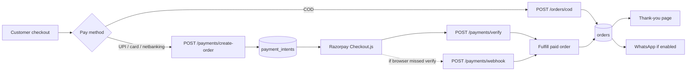
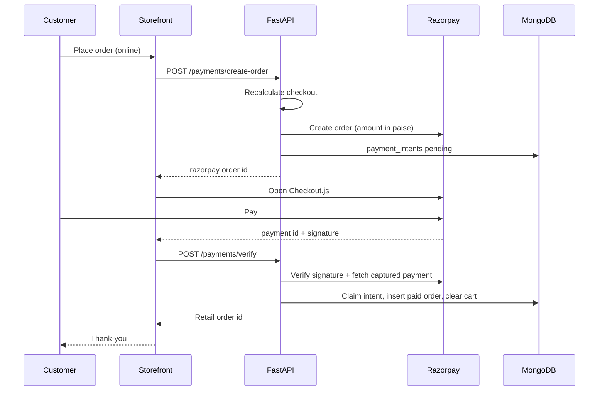
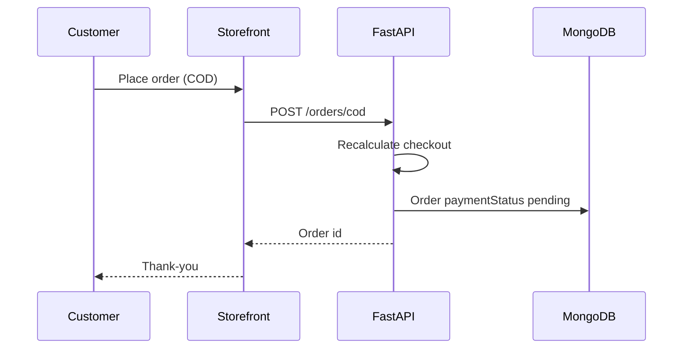
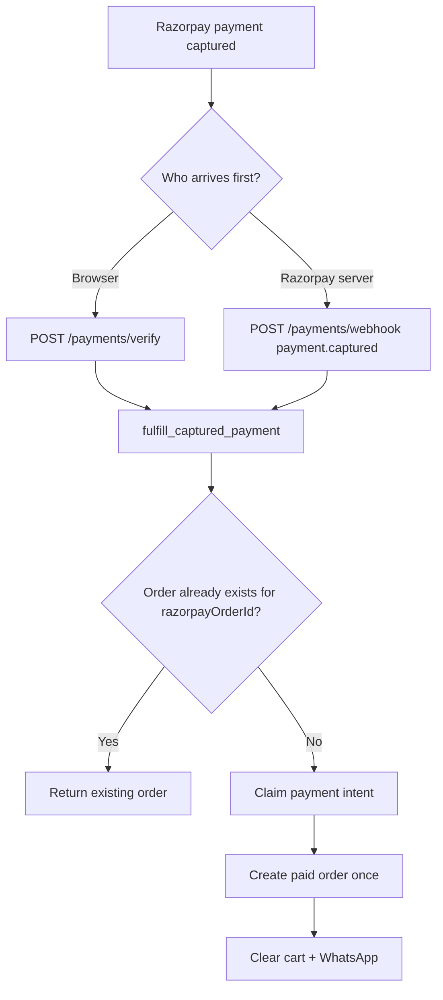

# Payment workflow

Retail checkout supports **Cash on Delivery (COD)** and **online pay** via **Razorpay** (UPI, card, netbanking). The **Razorpay secret key** stays on the backend. The storefront only uses the **publishable key** (`VITE_RAZORPAY_KEY_ID`) to open Checkout.js.

**Customer checkout → FastAPI → Razorpay (online) or COD fulfill → order in MongoDB → thank-you page**

WhatsApp after a successful order is described in [whatsapp-workflow.md](./whatsapp-workflow.md).

Retail checkout only. Menu / dine-in uses **pay at counter**, not Razorpay.

## Setup

Backend env (never in the browser):

- `RAZORPAY_KEY_ID` / `RAZORPAY_KEY_SECRET` — create orders and verify payments
- `RAZORPAY_WEBHOOK_SECRET` — verify `POST /payments/webhook`

Frontend:

- `VITE_RAZORPAY_KEY_ID` — same **key id** as the backend (not the secret)

Register Razorpay webhook: **`payment.captured`** → `POST /payments/webhook` (or `/api/payments/webhook` if Nginx prefixes `/api`).

## Checkout preview

Before pay, the storefront calls **`POST /checkout/`**. FastAPI recalculates cart, coupon, address, and shipping (including Delhivery when connected). Totals used for payment come from the **server**, not the UI.

## Path A — Cash on delivery

1. Customer chooses COD and places the order.
2. Storefront calls **`POST /orders/cod`** (customer JWT).
3. FastAPI recalculates checkout, creates an order with `paymentMethod: cod`, `paymentStatus: pending`.
4. Cart is cleared; customer is sent to thank-you.
5. WhatsApp **order confirmation** (customer + store NEW ORDER) if enabled.

No Razorpay call. Money is collected on delivery.

## Path B — Online (Razorpay)

1. Customer chooses UPI / card / netbanking and places the order.
2. Storefront calls **`POST /payments/create-order`**.
3. FastAPI recalculates checkout, creates a Razorpay order (`payment_capture: 1`), and stores a **`payment_intents`** row (`pending`) with snapshot checkout, tenant, user, address, amount.
4. Checkout.js opens. Customer pays on Razorpay.
5. On success, Checkout.js returns `razorpay_order_id`, `razorpay_payment_id`, `razorpay_signature`.
6. Storefront calls **`POST /payments/verify`**.
7. FastAPI:
   - verifies the **checkout signature**
   - fetches Razorpay order + payment and checks **captured**, amount, tenant/user notes
   - **fulfills** the intent (claim intent → create paid order once → clear cart)
8. Customer goes to thank-you.
9. WhatsApp **order confirmation** and **payment success** if those toggles are on.

If the browser never reaches `/verify` (tab closed), **Razorpay webhook `payment.captured`** can still fulfill the same intent. Fulfillment is **idempotent**: the same `razorpayOrderId` does not create two retail orders.

Browser `payment.failed` only shows an error. Failed payments are **not** stored as orders and **not** sent on WhatsApp.

## After a paid order exists

Admins can inspect Razorpay order/payment status (`GET /payments/order/...`, `GET /payments/payment/...`) and issue a refund (`POST /payments/refund/...`) when authorized.

## MongoDB

| Collection | Role |
| --- | --- |
| `payment_intents` | Pending Razorpay order + checkout snapshot until fulfilled |
| `orders` | COD or paid retail order (`razorpayOrderId` unique when present) |

## Troubleshooting

| Symptom | What to check |
| --- | --- |
| “Payment is not configured” | `VITE_RAZORPAY_KEY_ID` in the client build |
| Create-order SSL / 502 | Machine CA / Razorpay reachability from the API host |
| Signature verification failed | Key secret matches the key id; payload not altered |
| Payment has not been captured | Checkout.js / dashboard; capture mode is automatic (`payment_capture: 1`) |
| Duplicate or missing order after pay | Webhook + verify both call the same fulfill; check intent status and `razorpayOrderId` on the order |
| Webhook ignored | Event must be `payment.captured`; `X-Razorpay-Signature` + `RAZORPAY_WEBHOOK_SECRET` |

---

## Workflow diagrams

### End-to-end

### Online pay (happy path)

### COD

### Verify vs webhook (same fulfill)

