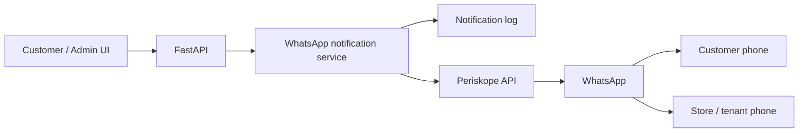
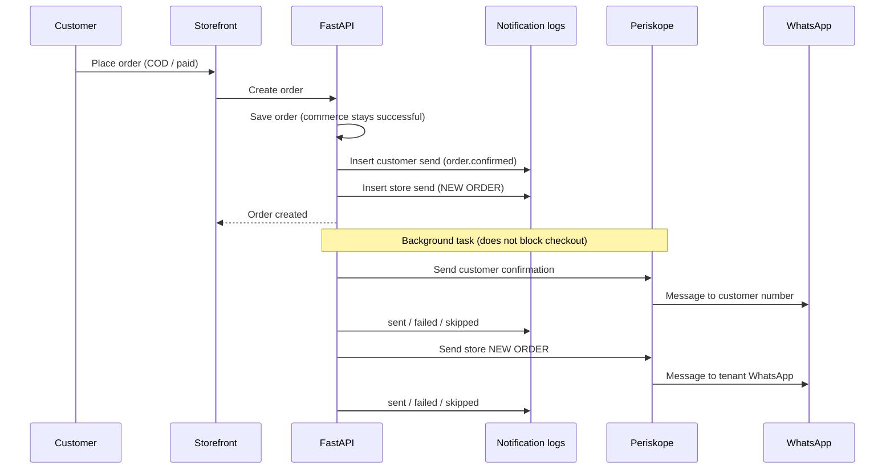
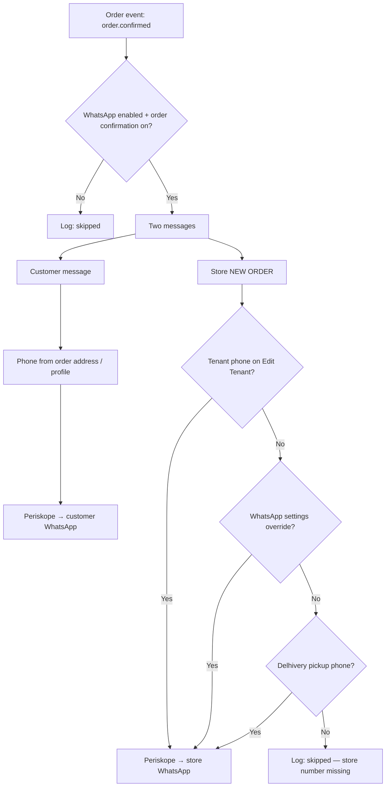
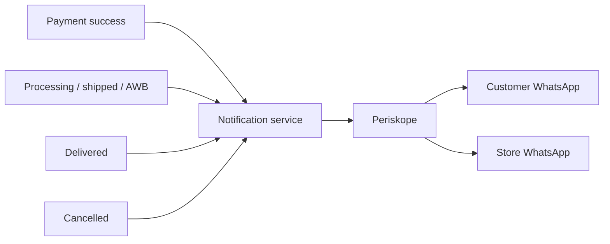

# WhatsApp (Periskope) workflow

Retail Cosmos sends WhatsApp messages through **Periskope**. The storefront never talks to Periskope.

**Customer / Admin UI → FastAPI → WhatsApp notification service → Periskope API → WhatsApp**

Shared Periskope credentials (`PERISKOPE_API_KEY`, `PERISKOPE_PHONE`) live only on the **backend**. Each store turns notifications on in **Admin → WhatsApp**.

For implementation detail (env vars, webhooks, indexes), see [periskope-integration.md](./periskope-integration.md).

## Setup (per store)

1. Platform: Periskope is connected on the server (API key + sender WhatsApp).
2. Store admin opens **Admin → WhatsApp**, tests the connection, enables notifications, and chooses event types.
3. Store WhatsApp number for **owner alerts** is the **tenant phone** on **Edit Tenant** (`9198XXXXXXXX`). Optional override: **Store WhatsApp number** on the WhatsApp settings page. If both are empty, Delhivery pickup phone is used as a fallback.

## When a customer places an order

1. Checkout / payment creates the order as usual.
2. FastAPI writes a **notification log** (idempotent) and sends the message in the **background**. Order create/payment is **not rolled back** if WhatsApp fails.
3. **Customer** gets the event on the phone from their delivery address.
4. **Store** gets a matching alert on the tenant WhatsApp number (customer name, phone, items, amount).

The same pattern is used for later events (if those toggles are on): payment success, processing, shipped / Delhivery AWB, delivered, cancelled.

## Message content

- Formatted WhatsApp text (and product image when a public URL exists).
- Caption layout: personalized first line, short body, optional price, **CHECKOUT NOW!** / **VIEW ORDER** / **TRACK ORDER** plus the storefront URL, then `HEAD BACK TO {STORE}`.
- Customer order links use the live storefront (never localhost). WhatsApp native CTA buttons cannot be sent from the browser or from Periskope’s documented send API.
- Logs store only **safe metadata** (event, masked phone, status). Message body is not stored.

## Status and retry

Each send is logged as pending → sending → **sent**, **failed**, or **skipped** (integration or event turned off).

Admins can retry failed/skipped items on **Admin → WhatsApp**.

## Inbound (webhooks)

Periskope can POST to **`/webhooks/periskope`**. The backend checks `x-periskope-signature` and stores event metadata only. Duplicates are ignored.

## What is not sent

- Payment **failure** (not persisted as a verified event).
- Out-for-delivery (not a Retail Cosmos order status).

## Troubleshooting

| Symptom | What to check |
| --- | --- |
| Not configured | Backend env: API key + sender phone; restart API |
| Skipped | Enable WhatsApp + the event toggle |
| Failed (customer) | Valid customer phone + country (India → `91`) |
| Store didn’t get NEW ORDER | Tenant WhatsApp number on **Edit Tenant** |
| Webhook 401 | Signing key + raw body forwarded by Nginx |

---

## Workflow diagrams

### End-to-end

### New order (customer + store)

### Who gets which number

### Later order events (same path)

Customer and store both get WhatsApp for order events when that toggle is on. Product share still goes to the customer only.
